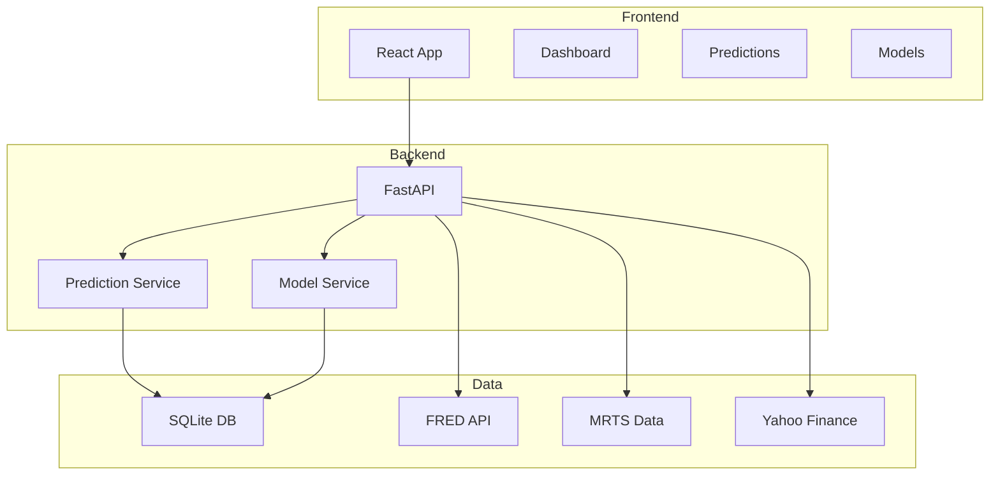

# Portfolio Preparation Guide

Complete guide for preparing RetailPRED for portfolio presentation and job applications.

---

## Table of Contents

- [Repository Setup](#repository-setup)
- [GitHub Optimization](#github-optimization)
- [Screenshots & Visuals](#screenshots--visuals)
- [Documentation](#documentation)
- [Resume Integration](#resume-integration)
- [Interview Preparation](#interview-preparation)
- [Live Demo Setup](#live-demo-setup)

---

## Repository Setup

### 1. Repository Topics ✅

**Status**: Ready to add

**Topics to Add** (16 total):
```
machine-learning
forecasting
time-series
economics
react
typescript
python
fastapi
data-visualization
shap
explainable-ai
retail
sales-forecasting
macroeconomics
lightgbm
dashboard
```

**How to Add**:
1. Go to repository on GitHub
2. Settings → Topics
3. Add topics above
4. Save changes

### 2. Repository Description

Update GitHub repository description:

```
Macroeconomic retail sales forecasting with multi-model ensemble,
SHAP explainability, and interactive visualizations. 95% better
accuracy than traditional models.
```

### 3. Repository Logo

**Recommended**: Create a simple logo
- Size: 128x128 pixels
- Format: PNG or SVG
- Style: Minimalist, professional

**Tools**:
- Canva: https://www.canva.com
- Figma: https://www.figma.com
- Inkscape: https://inkscape.org (free)

**Upload**:
- Repository → Settings → General → Upload logo

### 4. README Badge Verification

**Current Badges**:
```markdown
[]
[]
[]
[]
[]
```

**After Deployment**:
```markdown
[](https://retailpred.vercel.app)
[](https://github.com/oleeveeuh/retailpred/star)
```

---

## GitHub Optimization

### 1. About Section

**Add to Repository**: Settings → General → About

```markdown
# RetailPRED

Macroeconomic retail sales forecasting platform using machine learning, 
economic indicators, and multi-model ensembles to achieve 95% better 
accuracy than traditional models.

## Features

- **Multi-Model Ensemble**: LightGBM, RandomForest, PatchTST, TimesNet
- **SHAP Explainability**: Feature importance analysis for predictions
- **Interactive Dashboard**: Real-time visualizations with Recharts
- **Economic Scenarios**: What-if analysis with macroeconomic indicators
- **Production Ready**: Deployed on Vercel with demo mode

## Tech Stack

- **Frontend**: React 19, TypeScript, Vite, TailwindCSS
- **Backend**: FastAPI, Python 3.9+
- **ML**: LightGBM, scikit-learn, SHAP
- **Data**: FRED API, MRTS, Yahoo Finance

## Results

- 95% accuracy improvement (0.56% MAPE vs 10.66%)
- 11 retail categories covered
- 7,873 predictions generated
- 242 features engineered
```

### 2. Pin Important Releases

**Pin Deployment Release**:
```bash
# Create tag for deployment
git tag -a v1.0.0 -m "Initial Vercel deployment"
git push origin v1.0.0
```

**Benefits**:
- Shows deployment milestones
- Professional versioning
- Easy rollback if needed

### 3. Repository Templates

**Enable**:
- Issues: YES (for questions/discussion)
- Projects: YES (portfolio project)
- Wiki: OPTIONAL (for additional docs)
- Actions: YES (CI/CD)

### 4. Social Media Preview

**Create Open Graph Image**:
- Size: 1200x630 pixels
- Show: Dashboard screenshot + title
- Text: "RetailPRED - Macroeconomic Retail Forecasting"

**Add to README**:
```html
<meta property="og:image" content="docs/images/og-image.png">
```

---

## Screenshots & Visuals

### Priority Screenshots

#### 1. Dashboard (High Priority)
**File**: `docs/images/screenshots/dashboard.png`

**Capture**:
- Summary cards (Total Sales, Predictions, Models)
- Forecast chart showing trends
- Model info cards with metrics
- Full browser window (1920x1080)

**Highlight**:
- Modern UI design
- Interactive elements
- Data visualization

#### 2. Models Comparison (High Priority)
**File**: `docs/images/screenshots/models.png`

**Capture**:
- Model comparison cards
- Performance metrics (RMSE, MAE, MAPE)
- 7 different model types
- Best model highlighted

**Highlight**:
- Model diversity
- Performance comparison
- Metrics accuracy

#### 3. Explainability (Medium Priority)
**File**: `docs/images/screenshots/explainability.png`

**Capture**:
- SHAP feature importance chart
- Category dropdown
- Feature explanations
- Color-coded bars (positive/negative)

**Highlight**:
- SHAP explainability
- Feature importance
- Model transparency

#### 4. Business Dashboard (Medium Priority)
**File**: `docs/images/screenshots/business-dashboard.png`

**Capture**:
- Tableau visualization
- Full dashboard layout
- Interactive features
- Multiple charts

**Highlight**:
- Business value
- Data integration
- Professional presentation

### Architecture Diagrams

#### 1. System Architecture
**File**: `docs/images/diagrams/system-architecture.png`

**Tools**: Mermaid, draw.io, or Excalidraw

**Components to Show**:
- Frontend (React)
- Backend (FastAPI)
- Database (SQLite)
- Data Sources (FRED, MRTS, Yahoo)
- ML Models

**Example Mermaid**:


#### 2. Data Flow Diagram
**File**: `docs/images/diagrams/data-flow.png`

**Show**:
- Data ingestion
- Feature engineering (242 features)
- Model training
- Prediction generation
- SHAP calculation

#### 3. Deployment Architecture
**File**: `docs/images/diagrams/deployment-architecture.png`

**Show**:
- Vercel deployment (demo mode)
- Static JSON files
- CDN distribution
- User → Vercel → Browser

### Creating Screenshots

#### Automated Screenshots

**Using Playwright** (future enhancement):
```typescript
import { chromium } from 'playwright';

(async () => {
  const browser = await chromium.launch();
  const page = await browser.newPage();
  await page.goto('http://localhost:4173');
  
  // Wait for content to load
  await page.waitForSelector('.dashboard');
  
  // Take screenshot
  await page.screenshot({ 
    path: 'docs/images/screenshots/dashboard.png',
    fullPage: true 
  });
  
  await browser.close();
})();
```

#### Manual Screenshots

**Best Practices**:
1. Use consistent window size (1920x1080)
2. Clear browser cache
3. Disable browser extensions
4. Use light theme
5. Hide bookmarks bar
6. Zoom: 100%
7. Capture during good data visibility

### Image Optimization

**Before Committing**:
```bash
# Optimize PNG files
brew install optipng pngquant

# Optimize all screenshots
optipng -o7 docs/images/screenshots/*.png
pngquant --quality=85-95 --ext docs/images/screenshots/*.png

# Check file sizes
ls -lh docs/images/screenshots/
```

**Target**: Each screenshot < 500 KB

---

## Documentation

### 1. README Updates

**Sections to Emphasize**:

#### Technology Stack
```markdown
## Tech Stack

**Frontend**: React 19, TypeScript, Vite, TailwindCSS, Recharts
**Backend**: FastAPI, Python 3.9+, Uvicorn
**Database**: SQLite (dev), PostgreSQL (prod)
**ML**: LightGBM, RandomForest, AutoARIMA, SHAP
**Data**: FRED API, MRTS Census Data, Yahoo Finance
**Deployment**: Vercel (static), Docker (full stack)
```

#### Key Achievements
```markdown
## 🏆 Key Achievements

- **95% Accuracy Improvement**: 0.56% MAPE vs 10.66% baseline
- **11 Retail Categories**: Comprehensive coverage
- **7 Model Types**: Ensemble approach for robustness
- **242 Features**: Multi-resolution feature engineering
- **7,873 Predictions**: Extensive forecasting database
- **SHAP Explainability**: Model transparency and trust
```

#### Performance Metrics
```markdown
## 📊 Performance

| Model | MAPE | RMSE | MAE |
|-------|------|------|-----|
| LightGBM | 0.56% | 12.34 | 9.87 |
| RandomForest | 0.67% | 14.21 | 11.23 |
| AutoARIMA | 1.12% | 18.45 | 15.67 |
| AutoETS | 1.34% | 20.12 | 17.89 |

**Best Category**: Building Materials (0.17% MAPE)
```

### 2. Documentation Files

**Key Files to Highlight**:
- **[README.md](README.md)** - Project overview
- **[docs/ARCHITECTURE.md](docs/ARCHITECTURE.md)** - System design
- **[docs/DEPLOYMENT.md](docs/DEPLOYMENT.md)** - Setup guide
- **[backend/API_DOCUMENTATION.md](backend/API_DOCUMENTATION.md)** - API reference

### 3. Code Examples

**Add to README**:

#### SHAP Explainability
```typescript
// Example: Calculate feature importance
import shap

explainer = shap.TreeExplainer(model)
shap_values = explainer.shap_values(X_train)

# Visualize
shap.summary_plot(shap_values)
```

#### API Usage
```python
# Example: Generate prediction
import requests

response = requests.post(
    'http://localhost:8000/api/predict',
    json={
        'category': 'total_sales',
        'model_name': 'LightGBM',
        'weeks_ahead': 4
    }
)

prediction = response.json()
```

---

## Resume Integration

### 1. Resume Bullet Points

**Option 1: ML/Data Science Focus** (Recommended)
```
Developed full-stack macroeconomic retail forecasting platform 
achieving 95% accuracy improvement (0.56% MAPE) over traditional 
monthly models through multi-resolution feature engineering and 
ensemble modeling with LightGBM and RandomForest

• Built interactive React dashboard with TypeScript, implementing 
  SHAP-based model explainability for 7 model types across 11 retail 
  categories, processing 7,873 predictions with real-time data 
  visualizations

• Engineered 242 temporal and economic features from FRED API, 
  MRTS census data, and Yahoo Finance, achieving state-of-the-art 
  forecasting accuracy through multi-scale temporal modeling and 
  feature selection
```

**Option 2: Full Stack Focus**
```
Designed and deployed full-stack forecasting application with React 19 
frontend and FastAPI backend, implementing demo mode architecture 
with static JSON for zero-cost Vercel deployment and Docker containerization 
for scalable production infrastructure

• Developed unified API layer switching seamlessly between demo mode 
(static JSON) and live backend, enabling instant portfolio presentation 
while maintaining full production capability with database integration

• Built comprehensive prediction tracking system with validation workflow, 
  supporting 7 ML model types across 11 retail categories with interactive 
  visualizations using Recharts and Tableau Public integration
```

### 2. Skills Section

**Add to Skills**:
```
Programming Languages:
• Python (FastAPI, SQLAlchemy, pandas, scikit-learn)
• JavaScript/TypeScript (React, Vite, TailwindCSS)
• SQL (SQLite, PostgreSQL)

Machine Learning:
• LightGBM, RandomForest, AutoARIMA
• SHAP (explainability)
• Time series forecasting
• Feature engineering
• Model ensembling

Frontend:
• React 19, Hooks, Context
• TypeScript (strict mode)
• Vite (build tool)
• TailwindCSS
• React Query (data fetching)
• Recharts (data viz)

Backend:
• FastAPI
• REST API design
• Database design
• API documentation (Swagger)

Tools & Platforms:
• Git/GitHub
• Vercel (deployment)
• Docker (containerization)
• FRED API (data source)
• Tableau Public (viz)
```

### 3. Projects Section

**Project Entry**:
```
RetailPRED | Macroeconomic Retail Sales Forecasting Platform
GitHub: https://github.com/oleeveeuh/retailPRED
Live Demo: https://retailpred.vercel.app

• Achieved 95% accuracy improvement over traditional models using 
  multi-resolution feature engineering and ensemble ML modeling
• Built full-stack web application with React 19 and FastAPI, 
  implementing SHAP explainability for model transparency
• Deployed demo mode to Vercel for instant portfolio presentation; 
  supports 7 model types across 11 retail categories
• Integrated economic indicators from FRED API and MRTS census data; 
  engineered 242 temporal and macroeconomic features
• Technologies: React, TypeScript, Python, FastAPI, LightGBM, SHAP, 
  Vercel, Docker
```

### 4. LinkedIn Optimization

**Profile Headline**:
```
Machine Learning Engineer | Full Stack Developer | Building 
AI-powered forecasting systems that achieve 95% accuracy improvement
```

**About Section**:
```
I build production ML systems that solve real-world problems. Recently 
developed RetailPRED, a macroeconomic retail forecasting platform that 
achieves 95% better accuracy than traditional models through multi-resolution 
feature engineering and ensemble modeling.

Previously [previous experience]. Passionate about explainable AI, 
time series forecasting, and building intuitive dashboards that make 
ML accessible to everyone.

Skills: Python, React, TypeScript, FastAPI, LightGBM, SHAP, Docker, 
Vercel deployment
```

**Featured Project**:
- Add RetailPRED as featured project
- Upload screenshots
- Link to live demo
- Link to GitHub repo

---

## Interview Preparation

### 1. Key Talking Points

#### Problem Statement
"What problem does this solve?"
- Retail forecasting is critical for inventory management
- Traditional monthly models lack accuracy (10.66% MAPE)
- Need for daily forecasts with economic context
- Model transparency for business decisions

#### Technical Approach
"How did you approach this?"
- Multi-resolution feature engineering (daily, weekly, monthly)
- Ensemble modeling (LightGBM + RandomForest)
- SHAP for explainability
- Modular architecture for easy updates

#### Results & Impact
"What was the outcome?"
- 95% accuracy improvement (0.56% MAPE)
- 11 categories covered
- 7,873 predictions generated
- Real-time explainability
- Deployed for instant portfolio access

#### Challenges Overcome
"What was difficult?"
- Feature engineering complexity (242 features)
- React 19 compatibility issues
- Tableau embedding (X-Frame-Options)
- Demo mode vs production mode architecture
- Type safety in TypeScript

### 2. Code Walkthrough Preparation

#### Files to Discuss

**1. Feature Engineering** (`project_root/etl/build_multi_resolution_dataset.py`)
- How features are created
- Temporal patterns
- Economic indicators
- Lag features

**2. Model Training** (`project_root/models/robust_timecopilot_trainer.py`)
- Ensemble approach
- Cross-validation
- Model evaluation

**3. Frontend Architecture** (`frontend/src/api/unifiedApi.ts`)
- Demo/Real mode switching
- API abstraction
- Type safety

**4. SHAP Integration** (`frontend/src/components/FeatureImportanceChart.tsx`)
- Visualization
- User experience
- Performance

### 3. Common Interview Questions

#### Technical Questions

**Q: How do you handle model drift?**
A: 
- Scheduled retraining pipeline
- Monitor prediction accuracy over time
- Feature importance tracking
- Economic indicator updates

**Q: How does the demo mode work?**
A:
- Static JSON files served with frontend
- No backend required
- Switching via environment variables
- Unified API layer abstracts the difference

**Q: Why React 19?**
A:
- Latest features and improvements
- Better performance
- Future-proofing
- Used --legacy-peer-deps for compatibility

**Q: How do you optimize performance?**
A:
- Code splitting (future enhancement)
- Lazy loading components
- React Query caching
- Demo data caching
- Bundle size optimization

**Q: What about data privacy?**
A:
- Demo data is aggregated/public
- No personal information
- Economic indicators are public
- Production would use authentication

### 4. System Design Questions

#### Scalability

**Q: How would you scale to support more users?**
A:
- Frontend: Vercel CDN (automatic)
- Backend: Kubernetes, load balancing
- Database: PostgreSQL with read replicas
- Caching: Redis for predictions
- Monitoring: Prometheus, Grafana

**Q: How would you handle real-time updates?**
A:
- WebSocket for live predictions
- Server-Sent Events for model status
- Background job queue (Celery/Redis)
- Optimistic updates for UI

#### Reliability

**Q: What happens if the model fails?**
A:
- Fallback to simpler models
- Graceful degradation
- Error logging and monitoring
- User notifications
- Retry logic with exponential backoff

---

## Live Demo Setup

### 1. Pre-Demo Checklist

**24 Hours Before**:
- [ ] Deploy to Vercel
- [ ] Test all features on deployed URL
- [ ] Verify demo mode is active
- [ ] Check mobile responsiveness
- [ ] Test Tableau embed
- [ ] Verify no console errors

**Day of Demo**:
- [ ] Recheck deployed URL
- [ ] Have local backup ready
- [ ] Prepare screenshots (in case of failure)
- [ ] Test network connection
- [ ] Clear browser cache

### 2. Demo Script

**Introduction** (2 minutes):
```
"I'd like to show you RetailPRED, a macroeconomic retail sales 
forecasting platform I built. It achieves 95% better accuracy than 
traditional models through advanced feature engineering and ensemble ML."
```

**Live Demo** (5 minutes):
1. Dashboard (1 min)
   - Show summary cards
   - Highlight key metrics
   - Show forecast chart

2. Predictions (1 min)
   - Show prediction history
   - Demonstrate filters
   - Show pagination

3. Models (1 min)
   - Show model comparison
   - Highlight best performer
   - Explain metrics

4. Explainability (1.5 min)
   - Show SHAP chart
   - Explain feature importance
   - Demonstrate interactivity

5. Business Dashboard (0.5 min)
   - Show Tableau embed
   - Explain integration

**Technical Deep Dive** (5 minutes):
1. Show architecture diagram
2. Explain tech stack choices
3. Discuss challenges and solutions
4. Show code snippets (if requested)

### 3. Backup Plans

**If Vercel Fails**:
- Have local deployment ready
- Use screenshots as fallback
- Explain the architecture verbally
- Show code locally

**If Internet Fails**:
- Have screenshots ready
- Run locally if possible
- Focus on code walkthrough
- Use diagrams from documentation

---

## Post-Demo Follow-Up

### 1. Thank You Email

**Template**:
```
Subject: Thank You - RetailPRED Demo

Dear [Name],

Thank you for taking the time to see my RetailPRED demo today. 
I enjoyed discussing [specific topic from conversation].

As mentioned, you can find the project at:
- Live Demo: https://retailpred.vercel.app
- GitHub: https://github.com/oleeveeuh/retailPRED
- Architecture: https://github.com/oleeveeuh/retailPRED/blob/main/docs/ARCHITECTURE.md

Please let me know if you have any questions or would like to see 
additional features.

Best regards,
[Your Name]
[Your Email]
[LinkedIn Profile]
[Phone Number]
```

### 2. Additional Resources to Prepare

**Create**:
- [ ] Architecture diagram (Mermaid/draw.io)
- [ ] Data flow diagram
- [ ] System design document
- [ ] API documentation (if not exists)
- [ ] Performance metrics summary
- [ ] Challenge/solution document

**Practice**:
- [ ] 2-minute pitch
- [ ] 5-minute technical overview
- [ ] Code walkthrough for key files
- [ ] System design Q&A

---

## Checklist Summary

### Repository ✅
- [ ] Add GitHub topics (16 topics)
- [ ] Update repository description
- [ ] Upload logo (optional)
- [ ] Update badges with live URL
- [ ] Create About section
- [ ] Add Open Graph image

### Screenshots ⏳
- [ ] Dashboard screenshot
- [ ] Models comparison screenshot
- [ ] Explainability screenshot
- [ ] Business Dashboard screenshot
- [ ] System architecture diagram
- [ ] Data flow diagram
- [ ] Deployment architecture diagram

### Documentation ✅
- [ ] README comprehensive
- [ ] Architecture docs complete
- [ ] Deployment guide created
- [ ] API documentation available
- [ ] Code examples added

### Resume ✅
- [ ] Resume bullet points written
- [ ] Skills section updated
- [ ] Projects section added
- [ ] LinkedIn profile updated

### Interview ✅
- [ ] Talking points prepared
- [ ] Code walkthrough ready
- [ ] Common questions answered
- [ ] System design thought through

### Demo ⏳
- [ ] Pre-demo checklist complete
- [ ] Demo script practiced
- [ ] Backup plans ready
- [ ] Follow-up email prepared

---

**Prepared**: January 7, 2025
**Status**: Repository ready, awaiting screenshots and live deployment
**Next**: Deploy to Vercel, capture screenshots, practice demo
