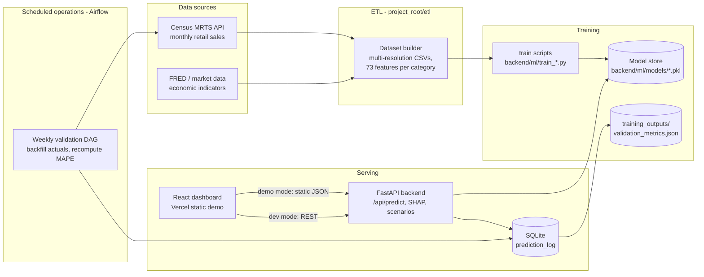
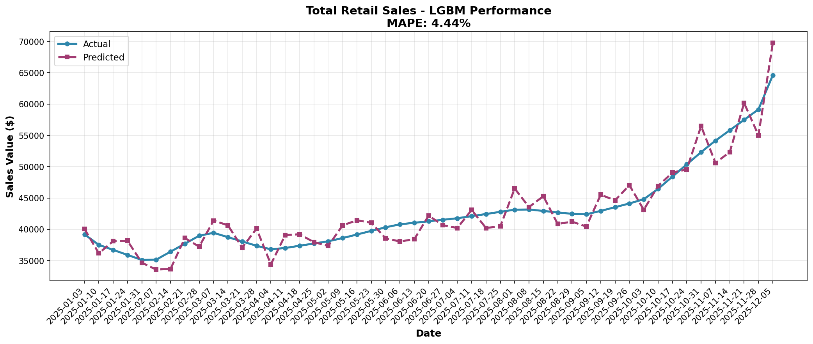

# RetailPRED

Retail sales forecasting for 11 U.S. retail categories — from raw Census data through feature engineering, model training, explainability, validation, and an interactive dashboard.

[](https://retail-pred.vercel.app)
[](https://www.python.org)
[](https://nodejs.org)
[](LICENSE)

## Problem

Monthly retail sales series published by the U.S. Census Bureau's [Monthly Retail Trade Survey (MRTS)](https://www.census.gov/retail/mrts.html) lag by several weeks. RetailPRED explores whether machine-learning models trained on that history — plus engineered lag, rolling, and calendar features — can produce useful weekly forecasts per category, and makes every forecast inspectable: confidence intervals, SHAP feature attributions, and continuous back-testing against published actuals.

## What's in the box

- **Gradient-boosted forecasting models** — LightGBM and RandomForest per category (22 trained models), selected over statistical baselines after evaluating AutoARIMA, AutoETS, SeasonalNaive, and (in an earlier pipeline iteration) PatchTST/TimesNet.
- **73 time-series features per category** — lags, rolling statistics, rate-of-change, momentum, year-over-year, and cyclical calendar encodings. The `year` column is deliberately excluded from training.
- **SHAP explainability** — per-prediction feature attributions for both tree models, surfaced in the UI.
- **Continuous validation** — an Airflow-scheduled job backfills published Census actuals onto logged weekly predictions and recomputes MAPE per model/category.
- **FastAPI backend** — forecasts, model metadata, SHAP explanations, scenario analysis, CSV exports.
- **React 19 + TypeScript dashboard** — [runs as a static demo](https://retail-pred.vercel.app) on pre-generated JSON, or against the live backend in development.

## Architecture


```mermaid
flowchart LR
    subgraph data [Data sources]
        MRTS[Census MRTS API<br/>monthly retail sales]
        FRED[FRED / market data<br/>economic indicators]
    end

    subgraph etl [ETL - project_root/etl]
        BUILD[Dataset builder<br/>multi-resolution CSVs,<br/>73 features per category]
    end

    subgraph train [Training]
        TRAIN[train scripts<br/>backend/ml/train_*.py]
        MODELS[(Model store<br/>backend/ml/models/*.pkl)]
        METRICS[(training_outputs/<br/>validation_metrics.json)]
    end

    subgraph serve [Serving]
        API[FastAPI backend<br/>/api/predict, SHAP, scenarios]
        DB[(SQLite<br/>prediction_log)]
        UI[React dashboard<br/>Vercel static demo]
    end

    subgraph ops [Scheduled operations - Airflow]
        DAG[Weekly validation DAG<br/>backfill actuals, recompute MAPE]
    end

    MRTS --> BUILD
    FRED --> BUILD
    BUILD --> TRAIN --> MODELS
    API --> MODELS
    API --> DB
    DAG --> MRTS
    DAG --> DB
    DB --> METRICS
    UI -->|demo mode: static JSON| API
    UI -->|dev mode: REST| API
```

## Dataset

| | |
|---|---|
| **Source** | U.S. Census Bureau MRTS (via [Census API](https://api.census.gov/data/timeseries/eits/mrts)), plus FRED and market data for indicators |
| **Scope** | 11 retail categories (auto dealers, building materials, clothing, electronics, food & beverage, furniture, gasoline stations, general merchandise, health & personal care, sporting goods, total retail sales) |
| **Granularity** | Monthly official figures, expanded to weekly/daily "multi-resolution" series used for feature engineering (`project_root/data_multi_resolution/`, ~457–5,815 rows per category) |
| **History** | 2015 → 2025 |
| **Split** | Chronological: models train on pre-2025 rows; 2025 is used for out-of-sample validation via backfilled actuals (no random splitting) |

## Methodology and its honest limits

- **Temporal ordering** — training data never includes the evaluation year; features at prediction time are computed only from past observations.
- **`year` excluded** — dropping the raw year column removed an obvious shortcut the early models used.
- **Known caveat: rolling features are inclusive.** The `rolling_mean_*` / `pct_change_*` features in the training CSVs are computed with pandas' default (inclusive) windows, so the current observation leaks into those columns at training time. This inflates training-split metrics (the old in-sample report showed unrealistically low error). The **published results below do not come from those numbers** — they come from 2025 predictions logged by the models and compared against independently published Census actuals, which the inclusive-window issue does not inflate the same way. Details and the exact feature list: [docs/methodology.md](docs/methodology.md).
- **Actuals are approximations.** Census publishes *monthly* category totals; the validation job scales them into forecast units (per-category factors in `config.py`) and applies the same monthly value to every weekly prediction in that month. So "samples" below are validated weekly rows, not independent monthly observations.

## Results (authoritative)

From [`training_outputs/validation_metrics.json`](training_outputs/validation_metrics.json), generated 2026-02-14 by comparing logged weekly predictions against published Census actuals:

**Evaluation window:** weekly predictions dated 2025-01-05 → 2025-10-26 (the weeks with backfilled actuals). Trained on pre-2025 data only.

| Model | Avg MAPE | Categories | Validated samples | Notes |
|---|---|---|---|---|
| **LightGBM** | **9.8%** | 11 | 429 | Best model; SHAP-explainable; used as the default |
| **RandomForest** | **10.1%** | 11 | 429 | Close second; SHAP-explainable |
| SeasonalNaive | 14.1% | 11 | 473 | Baseline (same week last year) |
| PatchTST* | 17.9% | 10 | 430 | Legacy-pipeline label — see note |
| TimesNet* | 18.6% | 10 | 430 | Legacy-pipeline label — see note |
| AutoARIMA | 34.8% | 7 | 301 | Failed to train on 4 categories; poor fit |

\* **About PatchTST/TimesNet:** a genuine neural implementation (Nixtla `neuralforecast`) was evaluated in an earlier training pipeline that is no longer part of this repository. The rows logged under those names — and the MAPEs above — come from a trend/seasonal heuristic used after that pipeline was retired; no transformer weights are shipped here. AutoETS was removed entirely after failing badly on the 2025 distribution shift.

Per-category LGBM MAPE ranges from **5.9%** (clothing) to **15.1%** (sporting goods) — full breakdown in [`training_outputs/validation_metrics.json`](training_outputs/validation_metrics.json).

Sample diagnostic generated by the training pipeline (Total Retail Sales, LGBM — per-chart MAPE computed over the full plotted year, which spans more weeks than the validation window above):



**What is *not* claimed:** this is not a production system, there is no deployed backend (the live demo is a static build with pre-generated data), forecasts for 2026 are unvalidated, and the models are trained on ~10 years of one country's monthly retail aggregates — small data, wide error bars.

## Repository structure

```
retailPRED/
├── backend/                    # FastAPI service
│   ├── api/                    #   routes, schemas, scenario/category/export endpoints
│   ├── ml/                     #   inference, feature computation, training scripts
│   │   └── models/             #   22 trained .pkl models (LGBM + RandomForest × 11)
│   ├── services/               #   prediction, scenario, economic-context logic
│   └── db/                     #   SQLite helpers + schema migrations
├── frontend/                   # React 19 + TypeScript + Vite dashboard
│   └── public/demo-data/       # pre-generated JSON for the static demo
├── project_root/               # training pipeline
│   ├── etl/                    #   MRTS/FRED fetchers, dataset builders
│   └── data_multi_resolution/  #   feature CSVs per category (tracked)
├── data/                       # runtime SQLite DB (not tracked; initialize locally)
├── training_outputs/           # validation metrics, training report, diagnostics
├── dags/                       # Airflow DAG: weekly validation loop
├── tests/                      # pytest suite (see "Verify")
└── docs/                       # methodology, API reference, web-app guide
```

## Quick start

**Prerequisites:** Python 3.11, Node.js 20, Git. No API keys are needed to run the backend, frontend, or tests — only the optional data-fetching scripts use them.

```bash
git clone https://github.com/oleeveeuh/retailPRED.git
cd retailPRED

# --- Backend (FastAPI, port 8000) ---
cd backend
python3.11 -m venv venv && source venv/bin/activate
pip install -r requirements.txt
# initialize an empty SQLite database (the populated DB is not tracked)
python -m db.migrations --schema-path ../data/db/schema.sql --db-path ../data/retailpred.db
python -m uvicorn main:app --reload --port 8000

# --- Frontend (Vite, port 5173) ---  (new terminal, from repo root)
cd frontend
npm ci
npm run dev          # dev mode proxies to http://localhost:8000

# --- Or run everything at once ---
# from repo root: npm install && npm run dev
```

The pre-trained models are committed, so `/api/predict` works immediately. The database starts empty — forecast history accumulates as you use it.

### Verify

```bash
pytest                      # unit + smoke tests (backend tests auto-skip if deps missing)
cd frontend && npm run type-check && npm run lint && npm run build
```

### Retrain

```bash
pip install -r requirements.txt
python backend/ml/train_73_features.py       # LGBM + RandomForest, 11 categories
python backend/ml/train_statistical_models.py  # SeasonalNaive / AutoARIMA baselines
python train.py --category total_sales       # single category end-to-end
```

Training reads the tracked feature CSVs; no external downloads required.

### Example API call

```bash
curl "http://localhost:8000/api/predict?category=total_sales&model_name=LGBM&weeks_ahead=4&start_date=2026-01-05"
```

```json
{
  "model_name": "total_sales_LGBM_model",
  "forecasts": [
    {
      "date": "2026-01-05",
      "predicted_value": 65124.7,
      "confidence_interval_lower": 64670.0,
      "confidence_interval_upper": 65579.4
    }
  ],
  "shap_values": [{"feature": "lag_1w", "value": 210.4}],
  "features_used": 73
}
```

(Full endpoint reference: [docs/api.md](docs/api.md).)

## Environment variables

None are required to run or test the project. Optional, for data-fetching scripts:

| Variable | Used by |
|---|---|
| `MRTS_API_KEY` | `weekly_validation.py`, `backfill_actuals.py` ([free Census key](https://api.census.gov/data/key_signup.html)) |
| `FRED_API_KEY` | `project_root/etl/fetch_fred.py` |
| `RETAILPRED_DIR` | Airflow DAG (path to repo on the runner) |

Copy [`project_root/.env.example`](project_root/.env.example) to `project_root/.env` for local use. `.env` files are git-ignored; never commit real keys.

## Limitations

- **Weekly "actuals" are unit-scaled monthly Census values** replicated across the weeks of each month (per-category scaling factors in `config.py`); validation therefore overstates the number of independent observations.
- **Inclusive rolling windows** in the training features (see [Methodology](#methodology-and-its-honest-limits)) make training-time metrics optimistic; trust the 2025 backfill table above instead.
- **No neural models ship here** — PatchTST/TimesNet results predate the current repository contents (see results note).
- **Single-series, single-country data** — 11 correlated aggregate series, ~130 monthly observations each. No store/SKU-level signal.
- **Frontend demo mode is hard-wired** to static JSON; API mode requires running the backend locally.
- **Unvalidated forward forecasts** for 2026 exist in the demo data; they carry no error measurements.

## Future work

- Rebuild rolling/`pct_change` features with shifted windows and re-baseline all metrics.
- Reinstate PatchTST/TimesNet training (Nixtla `neuralforecast`) as first-class tracked artifacts.
- Probability intervals from quantile models instead of the current scaled heuristic.
- Walk-forward backtesting at monthly resolution against raw MRTS values (no weekly replication).
- Deploy the FastAPI service behind the demo frontend.

## Data and model-artifact policy

- **Tracked:** trained models (`backend/ml/models/`), feature CSVs (`project_root/data_multi_resolution/`), validation metrics, training diagnostics, and demo JSON — everything needed to reproduce the published numbers from a clean clone.
- **Not tracked:** the SQLite database (`data/retailpred.db`, ~55 MB — initialize via `db.migrations`), logs, and `.env`. `predictions.csv` at the repo root (if present locally) is an unvalidated forward forecast, regenerated by `generate_rolling_predictions.py`.
- **History note:** an earlier commit accidentally published `project_root/.env`; those credentials were rotated and the file removed from history. Report any residual secret you find per the security policy.

## License

[MIT](LICENSE). Census MRTS and FRED data are public domain / open government data.
