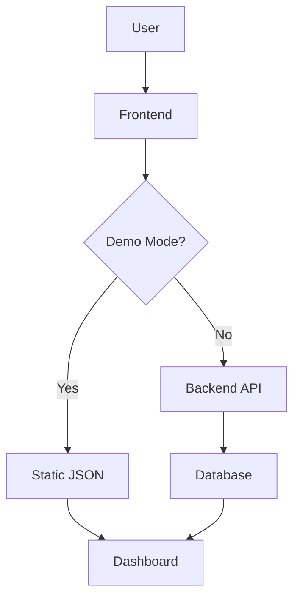

# Images Folder Structure

This directory contains images and screenshots for the RetailPRED documentation and portfolio.

## Directory Structure

```
docs/images/
├── screenshots/          # Application screenshots
│   ├── dashboard.png
│   ├── predictions.png
│   ├── models.png
│   ├── explainability.png
│   └── business-dashboard.png
└── diagrams/             # Architecture diagrams
    ├── system-architecture.png
    ├── data-flow.png
    └── deployment-architecture.png
```

## Screenshots Needed

### 1. Dashboard (screenshots/dashboard.png)
- Shows main dashboard with summary cards
- Displays forecast chart
- Shows model info cards
- Highlight key metrics

### 2. Predictions Page (screenshots/predictions.png)
- Shows prediction history table
- Displays filters working
- Shows pagination
- Highlight demo mode indicator

### 3. Models Page (screenshots/models.png)
- Shows model comparison cards
- Displays performance metrics
- Shows 7 model types
- Highlight best performing model

### 4. Explainability Page (screenshots/explainability.png)
- Shows SHAP feature importance chart
- Displays category selector
- Shows model selector
- Highlight feature explanations

### 5. Business Dashboard (screenshots/business-dashboard.png)
- Shows Tableau visualization
- Displays full layout
- Highlight interactive features

## Diagrams Needed

### 1. System Architecture (diagrams/system-architecture.png)
- Component diagram
- Data flow
- Technology stack
- Deployment architecture

### 2. Data Flow (diagrams/data-flow.png)
- Data ingestion pipeline
- Feature engineering
- Model training
- Prediction generation

### 3. Deployment Architecture (diagrams/deployment-architecture.png)
- Vercel deployment
- Docker deployment
- CI/CD pipeline

## How to Create Screenshots

### Using macOS
1. Open the application (http://localhost:4173)
2. Press `Cmd + Shift + 4` for region screenshot
3. Select the area to capture
4. Save to appropriate location
5. Rename file to match naming convention

### Using Windows
1. Open the application
2. Press `Win + Shift + S` for Snipping Tool
3. Select region to capture
4. Save to appropriate location
5. Rename file to match naming convention

### Using Browser DevTools
1. Open application
2. Open DevTools (F12)
3. Press `Cmd + Shift + P` (Mac) or `Ctrl + Shift + P` (Windows)
4. Type "screenshot"
5. Choose "Capture node screenshot"
6. Click on element to capture

## Screenshot Guidelines

### Quality Standards
- **Resolution**: 1920x1080 or higher
- **Format**: PNG (lossless)
- **File Size**: < 500 KB per screenshot
- **Content**: Full visible area of component

### Styling
- Use light theme for screenshots
- Ensure all content is loaded
- Hide browser UI elements
- Remove any personal data
- Use consistent window size

### Naming Convention
- Use lowercase with hyphens
- Descriptive names: `dashboard.png`, `predictions-page.png`
- Avoid spaces and special characters
- Keep names under 30 characters

## Image Optimization

Before committing screenshots:

1. **Compress images**:
   ```bash
   # Use optipng or pngquant
   brew install optipng pngquant
   
   # Optimize all PNGs
   optipng -o7 docs/images/**/*.png
   pngquant --quality=85-95 docs/images/**/*.png
   ```

2. **Check file sizes**:
   ```bash
   du -h docs/images/screenshots/*.png
   ```

3. **Convert to WebP (optional)**:
   ```bash
   # Convert to WebP for better compression
   cwebp -q 90 input.png -o output.webp
   ```

## Diagram Creation Tools

### Recommended Tools
1. **Mermaid.js** - Text-based diagrams
   - Online: https://mermaid.live
   - Documentation: https://mermaid.js.org

2. **draw.io** - Free diagramming tool
   - Online: https://app.diagrams.net
   - Export as PNG or SVG

3. **Excalidraw** - Hand-drawn style diagrams
   - Online: https://excalidraw.com
   - Good for system architecture

4. **PlantUML** - UML diagrams
   - Online: https://plantuml.com
   - Good for sequence diagrams

### Mermaid Example



## Adding Images to Documentation

### Markdown Format

```markdown
## Dashboard


The dashboard provides...
```

### README Format

```markdown
## Features


*Interactive dashboard with real-time predictions*
```

## Image Repository

For storing images externally:
- **GitHub** - Already in repo (recommended)
- **Imgur** - https://imgur.com (for quick sharing)
- **Cloudinary** - CDN + optimization (paid)
- **AWS S3** - For large scale (paid)

## Checklist

### Before Deployment
- [ ] All screenshots captured
- [ ] Images optimized (< 500 KB each)
- [ ] Files named correctly
- [ ] Placed in correct directories
- [ ] Added to documentation
- [ ] Tested in README rendering
- [ ] Committed to git

### After Deployment
- [ ] Screenshots display correctly
- [ ] Images load fast
- [ ] No broken image links
- [ ] Mobile users can see images

## Current Status

- [ ] Screenshots folder created
- [ ] Diagrams folder created
- [ ] README for images created
- [ ] Screenshot guidelines documented
- [ ] Actual screenshots pending

## Next Steps

1. Deploy application to Vercel
2. Capture screenshots from live site
3. Create architecture diagrams
4. Optimize all images
5. Add to documentation
6. Update README with images

---

**Last Updated**: January 7, 2025
**Status**: Structure ready, awaiting screenshots
